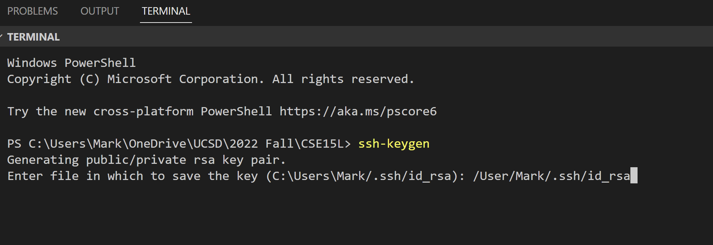

# Lab1 Report


## 1. Installing VScode

* Download VSCode at the website
* [Download VSCode Here]( https://code.visualstudio.com/)
* Install the correct version with your system (win/macos/linux)
* Open up a new terminal in VSCode (Ctrt + Shift + `)

## 2. Remotely Connecting

* First change ucsd tritonlink password
(force the system to update the password for this class)
* use the terminal in VSCode to use SSH to connect
* `SSH cs15lfa22(xx)@ieng6.ucsd.edu`
* change the (xx) to be your unique user name found on triton accounts
* wait for prompt and input the password
* by default you can't see your password while typing

## 3. Trying Some Commands

```
pwd: print working directory
ls: list the files in the current directory
cd: change directory
cp: copy file
```

## 4. Moving Files with scp

* use command `scp "file name" cs15lfa22(xx)@ieng6.ucsd.edu:~/` to upload the file
* enters the password
* should be visible in the remote server

## 5. Setting an SSH Key

* use command `ssh-keygen to initialize ssh key generator`
* type in the directory on your computer where you want to
store the ssh keys
* no need for passphrase so just type noting in the following prompts

## 6. Optimizing Remote Running

* `ssh cs15lfa22(xx)@ieng6.ucsd.edu "ls"` for direct access to list the files
* use the up arrow to retrieve previous command to save some time
* now with the ssh file we can enter the server without typing the password
