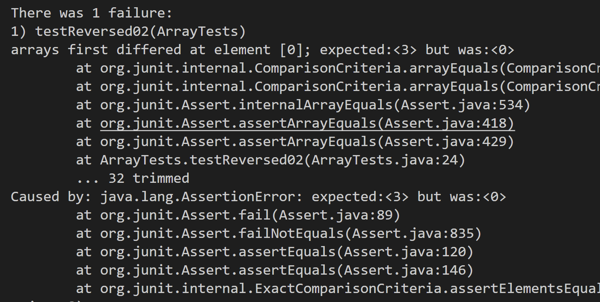
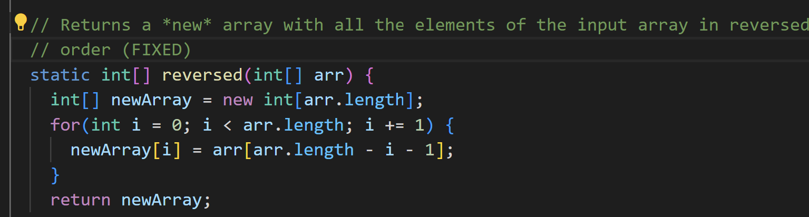
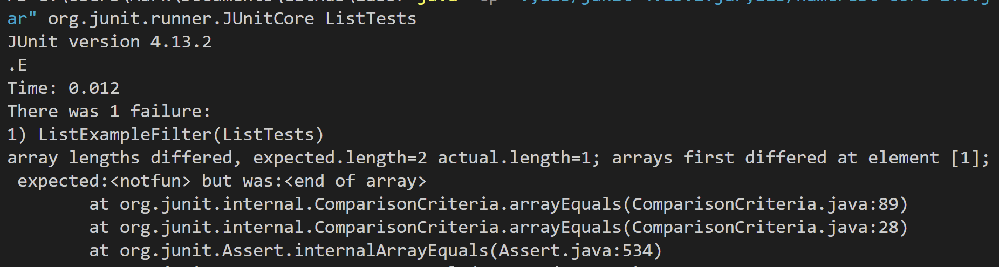
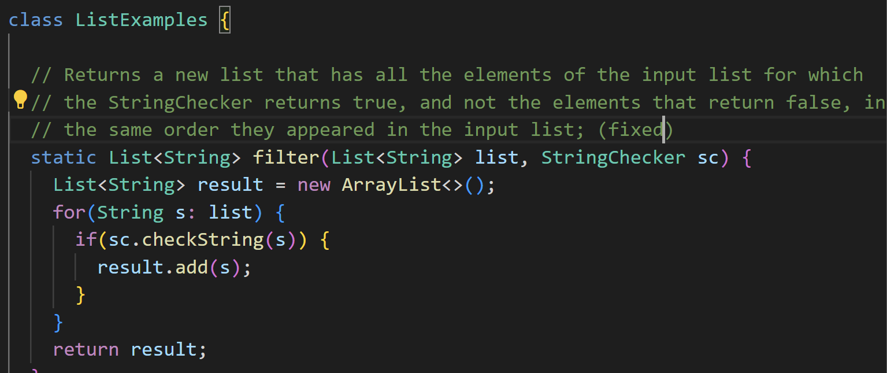

The failure-inducing input (the code of the test)
The symptom (the failing test output)
The bug (the code fix needed)
Then, explain the connection between the symptom and the bug. Why does the bug cause that particular symptom for that particular input?

# List Method (ArrayExamples)
* **Failure inducing input:**

* **Symptom:** the resulting array are all zeros '[0,0,0]'

* **Explaination:** the reversed method has two bugs. The first one is that it creates a new empty array and assigns in indices from the blank arry to the input array. This is why the output array is all zeros. The new array is set by default to be all zeros. The part `array[i] = newArray[arr.length - i - 1]' is bug. Secondly, the method modifys and outputs the original array instead of outputs the new array. It should return 'newArray' instead of returning 'arr'.

* **Fixed code:**

# ListExamples (filter)
* **Failure inducing input:**

* **Symptom:** the resulting array does not match the expected outcome. The order is backward.

* **Explaination:** the bug is that 'result.add(0, s)', where the code adds the string to the 0 index of the list. Due to the property of list, every time a new string is added, the existing strings will be pushed back. Thus, the resulting list is backward and does not match the expected result.

* **Fixed code:**

