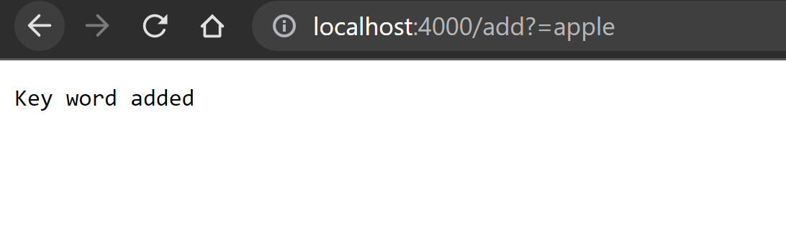
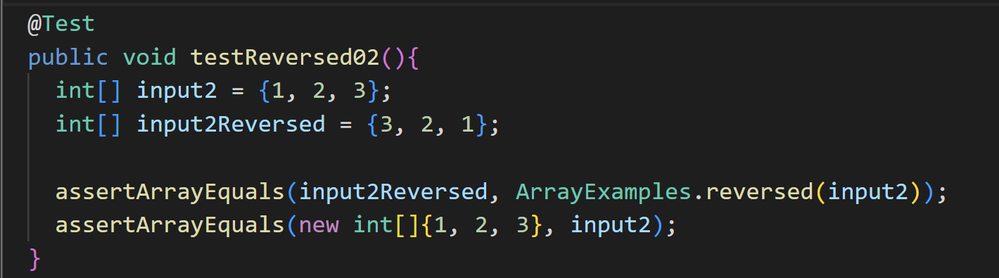
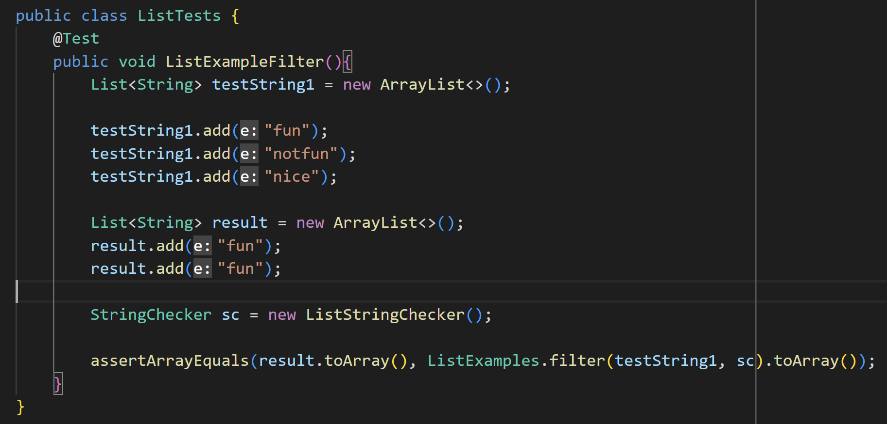

# Part 1: Simple Search Engine

## Welcome Page

* The default page when accessing the website
* `handleRequest` is called and `url.getPath().equals("/")` is true
* The website is directed to the root directory
* No values is changed, just tells the visitor how to use the website

## Add method

* `handleRequest` is called and `url.getPath().contains("/add"` is true
* The code begin reading the query (start with "?")
* Split the query in two parts by "=":
* `String[] parameters = url.getQuery().split("=");`
* Write the keyword "apple" to an arraylist

## Search method 

* `handleRequest` is called and `url.getPath().contains("/search")` is true
* The code begin reading the query (start with "?")
* Split the query in two parts by "=":
* `String[] keyword = url.getQuery().split("=");`
* Search the arraylist for matching; if yes, display a message on the website; if not, display another message

---
# Part 2: Debugging

## List Method (ArrayExamples)
* **Failure inducing input:**

* **Symptom:** the resulting array are all zeros `[0,0,0]`

* **Explaination:** the reversed method has two bugs. The first one is that it creates a new empty array and assigns in indices from the blank arry to the input array. This is why the output array is all zeros. The new array is set by default to be all zeros. The part `array[i] = newArray[arr.length - i - 1]` is bug. Secondly, the method modifys and outputs the original array instead of outputs the new array. It should return `newArray` instead of returning `arr`.

* **Fixed code:**

## ListExamples (filter)
* **Failure inducing input:**

* **Symptom:** the resulting array does not match the expected outcome. The order is backward.

* **Explaination:** the bug is that `result.add(0, s)`, where the code adds the string to the 0 index of the list. Due to the property of list, every time a new string is added, the existing strings will be pushed back. Thus, the resulting list is backward and does not match the expected result.

* **Fixed code:**
