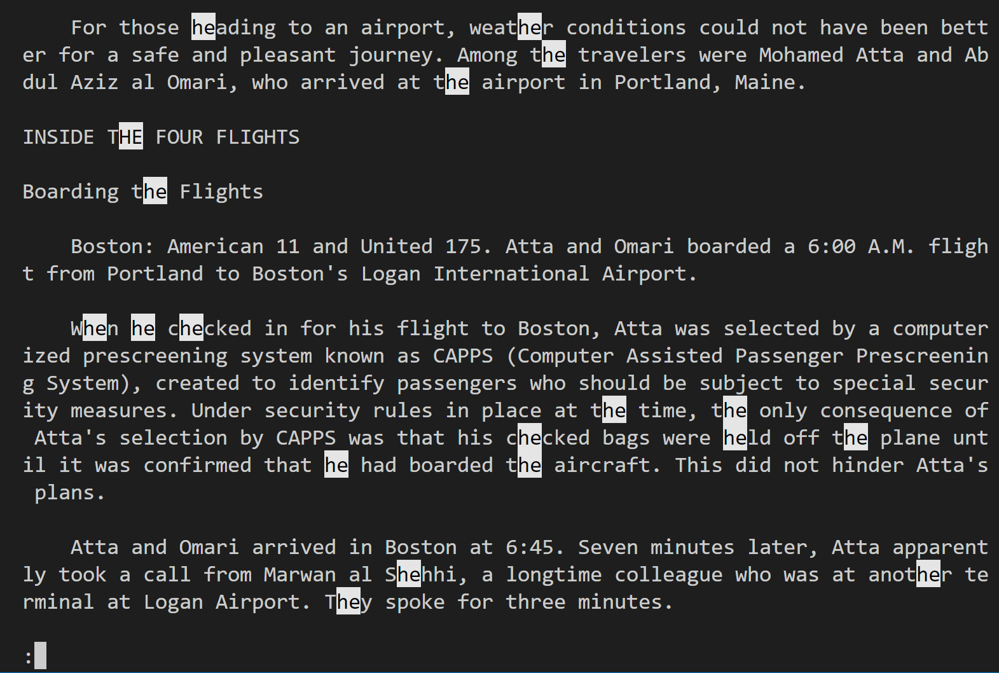

# CSE15L Lab Report 3

## Less Command

1. `less -N <filename>`
* Display the line number for each line
* Would be convenient when making reference to a specific line
* Makes it easier when editing the file\

 2. `less -X <filename>`
 * Leave the file contents on the screen after exiting less
 * By default, the file contents will be clear after viewing
 * Use `-X` can keep the contents on the screen for reference
 

  3. `less -I <filename>`
  * We can use /name to search a keyword when using less
  * However, by default it is case sensitive
  * To remove the case sensitive option, we use -I
  * Example below shows search keyword "HE"

## Find Command

4. `find <directory> -empty`
* We can use this to find all empty directory and files
* Can be benefical when organizing directory
* Search for empty paths and delete them

5. `find <directory> -name <filename> -exec rm -i {} \;`
* Search and delete a specific file with confirmation
* It will prompt a message asking for confirmation
* Type `y` will confirm deletion
* Can be used when organizing files and deleting unwanted files 

6. `find -type d/f -name "Keyword`
* `d` for only searching directory
* `f` for only searching file
* This can be convenient when we want to exclude directory or files when searching
* There are more options besides d/f

## Grep Command

7. `grep -c "pattern" <filename>`
* This will display the number of lines that matches the pattern in the file
* This could help us when we want determine the overall content of the file
* Can be used for doing analysis over large data\

8. `grep -w "pattern" <filename>`
* This will only checks pattern for whole word
* It can be helpful when we want to match exact whole words
* Can be used to to search specific section in the file

9. `grep -i "pattern" <filename>`
* This is a case insensitive search
* Can be helpful when searching a keyword in an article
* Without -i, the search will be case sensitive\
