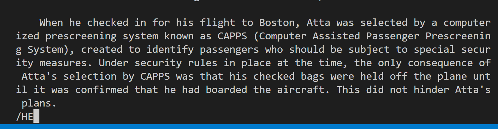

## Less Command

1. `less -N <filename>`
* Display the line number for each line
* Would be convenient when making reference to a specific line
* Makes it easier when editing the file
 

 2. `less -X <filename>`
 * Leave the file contents on the screen after exiting less
 * By default, the file contents will be clear after viewing
 * Use `-X` can keep the contents on the screen for reference
  

  3. `less -I <filename>`
  * We can use /name to search a keyword when using less
  * However, by default it is case sensitive
  * To remove the case sensitive option, we use -I
  * Example below shows search keyword "HE"
    
    

## Find Command

3. `find <directory> -empty`
* We can use this to find all empty directory and files
* Can be benefical when organizing directory
* Search for empty paths and delete them
    
    