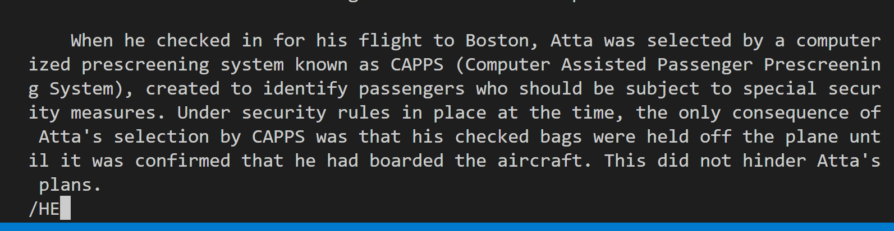
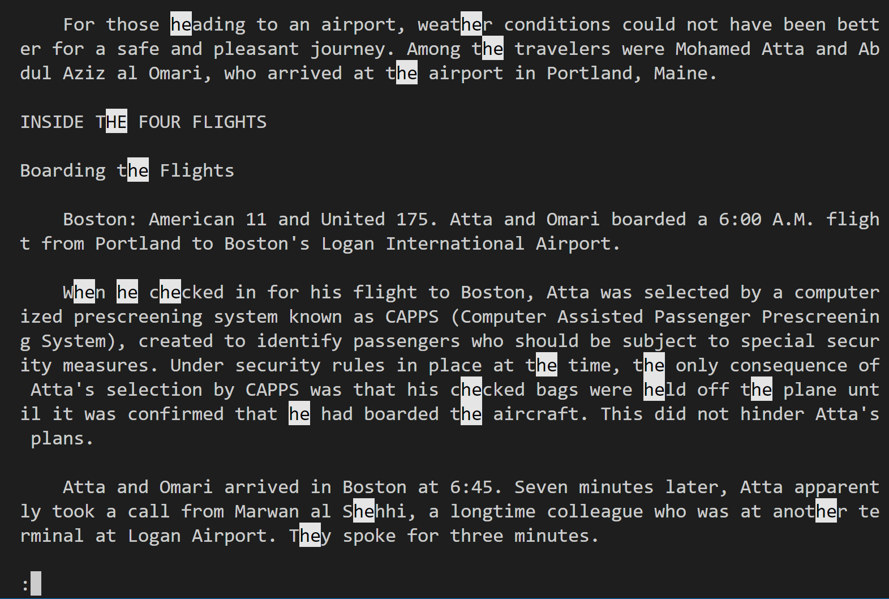
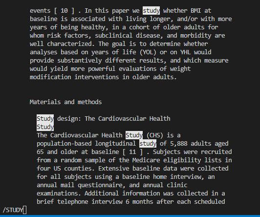
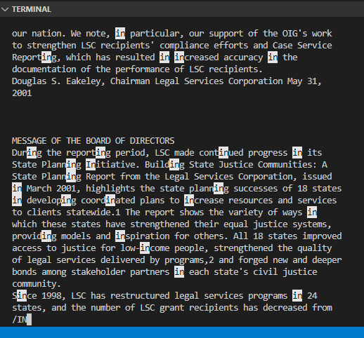
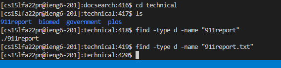
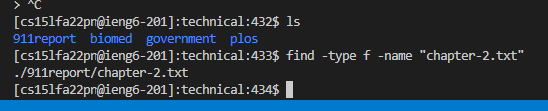
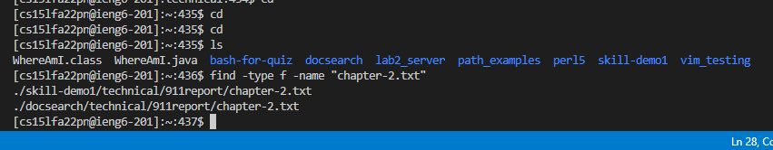
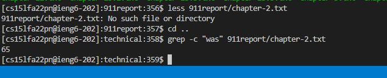
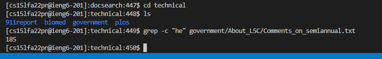
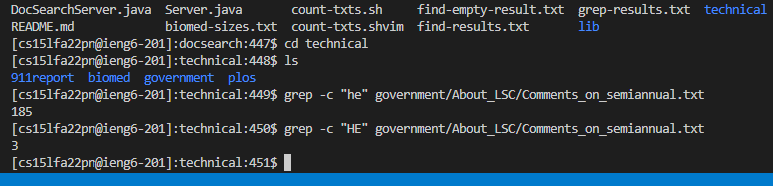

# CSE15L Lab Report 3

## `less -I <filename>`
* We can use /name to search a keyword when using less
* However, by default it is case sensitive
* To remove the case sensitive option, we use -I
* Search with /keyword in less mode

1. Example:\

* Searches keyword "HE" in 911report/chapter-1.txt
* This found all the words containing character "he" in both upper and lower cases

2. Example:\

* Searches keyword "STUDY" in biomed/1468-6708-3-1.txt
* Found all words containing "STUDY"
* Could make searching for keyword easier in a medical report

3. Example:\

* Search keyword "IN" in government/About_LSC/Comments_on_semiannual.txt
* Found all words containiing "in" though I was using upper case "IN"
* This is an very helpful feature when using search method in Less mode

##  `find -type d/f -name "Keyword`

4. Example:\

* `d` for only searching directory
* I searched for a directory named "911report" and got the result
* This can be convenient when we want to only search for directory

5. Example:\

* `f` for only searching file
* I searched a file named "chapter-2.txt" and found its location
* This can be convenient when we want to exclude directory when searching

6. Example:\

* `f` for only searching file
* This time i searched "chapter-2.txt" in the home directory of the remote account
* It found two files in two different directories on my account
* This can be useful when searching for a specific file and not looking at the directory

## `grep -c "pattern" <filename>`

7. Example:\

* This will display the number of matches of the pattern in the file
* I searched for keyword "was" in 911report/chapter-2.txt and found 65 matches
* Can be used for doing analysis over large data

8. Example:\

* The matches for keyword "he" in government/About_LSC/Comments_on_semiannual.txt is 185
* This feature can help us when we want to sort the articles by their theme

9. Example:\

* I searched for "HE" this time and only have 3 matches
* This shows that the -c method is case-sensitive
* We would need to pay attention to casing when counting patterns with -c