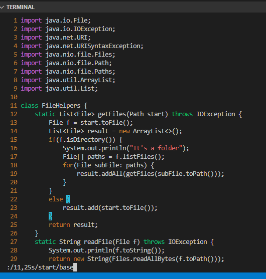
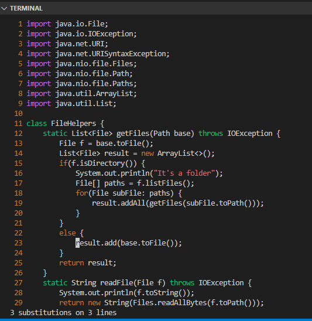

# CSE15L Lab Report 4

## Part 1: Changing the name of the `start` parameter and its uses to `base`

Vim sequence (assume already entered vim):
* ` /11,25s/start/base<Enter>`
\

* This is a one line command to change the parameter and all its uses
* ` <11,25s>` is for limiting the section of lines, since i only want to modify the section in ` getFiles` 
* It will only modify words between line 11 and 25
* ` <start/base>` means that replace all instances of "start" by "base"
* Result:\

## Part 2: 
* Edit local and upload: 30s
* Edit on remote: 25s

* Details: When editing locally on windows I cannot use vim, so changing editing
by manually replacing the names took sometimes. However, when editing remotely,
I sometimes make typoes and there is no auto-detection on vim.

Questions:
* Both methods have advantages and disadvantages. When editing locally, I an using
VScode to edi and it have syntax correction imbedded in the editor. So it is easier
for me to identify syntax error. When editing remotely using vim, though it's quicker
to since there is no need to upload the file, vim is not very friendly to beginners.
I sometimes struggled to use vim because it's opeartion is not intuitive and need
a lot of memorization for specific keystrokes. Currently I would choose to edit
locally. If I become better using vim I would switch to editing on remote for is
efficiency.

* If the task is to build a program from scratch I would first edit it locally
since the benefit of VScode makes it easier to write. When the task is close to
completion I would then upload and test it remotely. If the task is to debug or
make minor tweaks to the program I would choose to edit remotely because it would
be very efficient to edit and test immediately.