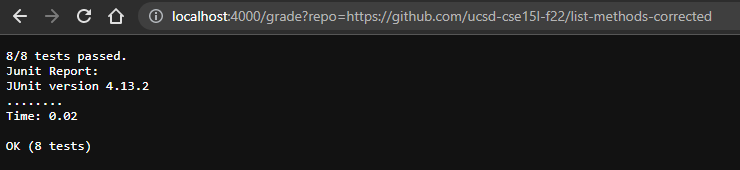
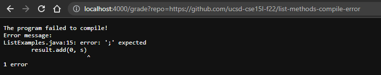
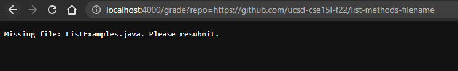

# CSE15L Lab Report 5

## `grade.sh` code block
```
CPATH=".:../lib/hamcrest-core-1.3.jar:../lib/junit-4.13.2.jar"
DIRECTORY="student_submissiom"
JUNITTEST="TestListExamples.java"

#check for duplicate directory for cloning
if [[ -d $DIRECTORY ]]; then
    rm -rf $DIRECTORY
fi

git clone $1 $DIRECTORY > /dev/null 2> gitErr.txt
cp $JUNITTEST $DIRECTORY/
cd $DIRECTORY

#check for file
if [[ ! -f ListExamples.java ]]; then
    echo "Missing file: ListExamples.java. Please resubmit."
    exit 2
fi

#compile and run program
javac -cp $CPATH *.java 2> COMPILE_ERR.txt
if [[ $? -ne 0 ]]; then
    echo -e "The program failed to compile!"
    echo -e "Error message:"
    cat COMPILE_ERR.txt
    exit 1
fi

#compiled and run the test
java -cp $CPATH org.junit.runner.JUnitCore TestListExamples > TEST_SCORE.txt

errline=`grep "^[\.E]\+$" < TEST_SCORE.txt`
counterr=`grep -o 'E' <<< $errline | wc -l`

echo "$((8-counterr))/8 tests passed."
echo "Junit Report:"
cat TEST_SCORE.txt

```

## Three different student submissions demo
1. All correct methods\


2. With a syntax error (compiler error)\


3. Saved in wrong filename\


## Trace code for demo 1 (All correct methods)

$1-3:
```
CPATH=".:../lib/hamcrest-core-1.3.jar:../lib/junit-4.13.2.jar"
DIRECTORY="student_submissiom"
JUNITTEST="TestListExamples.java"
```
* just saved as variables in bash, not stdout/stderr, not return codee

$6-7: if block
```
if [[ -d $DIRECTORY ]]; then
    rm -rf $DIRECTORY
fi
```
* the condition will evaluate to true because the submission directory was created in the last submission and still exist in the current directory
* successful, no stdout/stderr
* return code is 0

$10: `git clone $1 $DIRECTORY > /dev/null 2> gitErr.txt`
* clone the student submission to the test directory
* successful, stdout is that "cloning ( ) ..." and is directed to a null directory to hide it
* stderr is directed to gitErr.txt
* return code is 0

$11: `cp $JUNITTEST $DIRECTORY/`
* copying the junit test file to the test directory
* successful, no stdout/stderr
* return code is 0

$12: `cd $DIRECTORY`
* change directory to /submission
* succussful, not stdout/stderr
* return code is 0

$15-18:
```
if [[ ! -f ListExamples.java ]]; then
    echo "Missing file: ListExamples.java. Please resubmit."
    exit 2
fi
```
* the condition is evaluated to false since the file ListExamples.java exists in the test directory
* the block does not run

$21: `javac -cp $CPATH *.java 2> COMPILE_ERR.txt`
* compiles all the file in the current directory
* no stdout if succesful, return code 0
* compiler error message will be directed via stderr to COMPILE_ERR.txt file, return code 1

$22-27:
```
if [[ $? -ne 0 ]]; then
    echo -e "The program failed to compile!"
    echo -e "Error message:"
    cat COMPILE_ERR.txt
    exit 1
fi
```
* the condition will evaluate to false because the return code from previous javac command is 0, which means all the file have successfully compiled
* the block does not run

$30: `java -cp $CPATH org.junit.runner.JUnitCore TestListExamples > TEST_SCORE.txt`
* run the junit test on the student submission
* successful, stdout is redirected to TEST_SCORE.txt
* no error found so no stderr
* exit code 0

$32: 
```
`errline=`grep "^[\.E]\+$" < TEST_SCORE.txt`
```
* grep the pattern "." and "E" in the output file from junit test
* grep will take the entire line contaning the pattern
* the command is stored in variable named errline
* successful, no stdout/stderr
* no return code, this is not executed

$33:
```
counterr=`grep -o 'E' <<< $errline | wc -l`
```
* pipe the grep resulf of keyword "E" to wordcount -l
* each grep result of "E" will make a new line
* counting the number of lines gives the number of errors
* successful, no stdout/stderr
* return code 0

$35-36
```
echo "$((8-counterr))/8 tests passed."
echo "Junit Report:"
```
* printing out the score of the test
* std out is the messages
* return code 0

$37: `cat TEST_SCORE.txt`
* print out the messaged saved from the junit test
* stdout is the message in the txt file
* return code 0